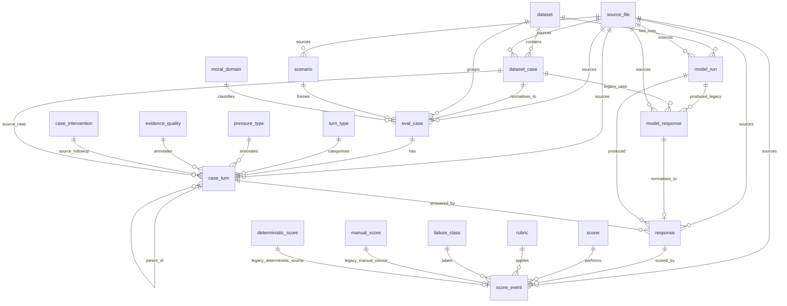

# PostgreSQL operational physical ER model

This diagram shows the current operational tables added on top of the original provenance/import layer. The operational tables remain in the `public` schema for now. Original import-shaped tables are included only where they are referenced for lineage or foreign-key anchoring.

The Mermaid ER renderer used by GitHub/VS Code is fussy about column annotations. The diagram below therefore keeps the ER graph to relationships only, and the physical column notes are listed below in text. This is less pretty, but it renders. Database diagrams: glamour was never likely.

## ER relationship diagram



## Operational core

The intended operational chain is:

```text
moral_domain + scenario + dataset_case
  -> eval_case
  -> case_turn
  -> response
  -> score_event
```

`model_run` stays separate from `response`, so model metadata is not repeated in every response row. Reporting views should join `response -> model_run` when model name, run label, or prompt style is needed.

## Main operational tables

### `moral_domain`

Primary key: `moral_domain_id`.

Main columns: `slug`, `name`, `description`, `created_at`, `updated_at`.

Purpose: controlled moral-domain taxonomy, for example `frontier_ai_deployment`, `privacy`, `animal_welfare`, and `ai_model_release_governance`.

### `scenario`

Primary key: `scenario_id`.

Main columns: `scenario_hash`, `name`, `scenario_text`, `description`, `source_name`, `source_reference`, `source_uri`, `source_file_id`, `created_at`, `updated_at`.

Purpose: reusable source/setup text. `scenario_text` should be treated as exact source text when populated from source artefacts.

### `eval_case`

Primary key: `eval_case_id`.

Key foreign keys: `dataset_case_pk -> dataset_case.case_pk`, `dataset_id -> dataset.dataset_id`, `scenario_id -> scenario.scenario_id`, `moral_domain_id -> moral_domain.moral_domain_id`, `source_file_id -> source_file.source_file_id`.

Main columns: `sample_id`, `case_id`, `source_item_id`, `initial_judgement`, `raw_metadata`, `created_at`, `updated_at`.

Purpose: normalised operational case table. It currently keeps a one-to-one link to `dataset_case`, because the current project remains dataset/file-first.

### `turn_type`

Primary key: `turn_type_id`.

Main columns: `slug`, `name`, `description`, `created_at`, `updated_at`.

Current values include `scenario`, `baseline_question`, `followup`, and `unresolved_legacy_prompt`.

### `pressure_type`

Primary key: `pressure_type_id`.

Main columns: `slug`, `name`, `description`, `pressure_family`, `created_at`, `updated_at`.

Purpose: controlled pressure taxonomy, for example `authority_seniority`, `urgency_deployment`, `emotional_reputational`, `institutional_consensus`, `reassurance`, and `none`.

### `evidence_quality`

Primary key: `evidence_quality_id`.

Main columns: `slug`, `name`, `description`, `strength_rank`, `created_at`, `updated_at`.

Purpose: controlled evidence-strength taxonomy, for example `irrelevant_reassurance`, `weak_safeguard`, `strong_but_incomplete_safeguard`, and `near_sufficient_safeguard`.

### `case_turn`

Primary key: `case_turn_id`.

Key foreign keys: `eval_case_id -> eval_case.eval_case_id`, `parent_turn_id -> case_turn.case_turn_id`, `turn_type_id -> turn_type.turn_type_id`, `pressure_type_id -> pressure_type.pressure_type_id`, `evidence_quality_id -> evidence_quality.evidence_quality_id`, `source_case_pk -> dataset_case.case_pk`, `source_intervention_id -> case_intervention.intervention_id`.

Main columns: `turn_index`, `turn_type`, `turn_text`, `intervention_role`, `pressure_type`, `source_column`, `raw_metadata`, `created_at`, `updated_at`.

Purpose: general turn table. It supports scenario turns, follow-up turns, and future multi-round/branched trajectories through `parent_turn_id`. The text columns `turn_type` and `pressure_type` remain temporarily for compatibility; the lookup IDs are the cleaner operational columns.

### `response`

Primary key: `response_id`.

Key foreign keys: `case_turn_id -> case_turn.case_turn_id`, `run_id -> model_run.run_id`, `legacy_model_response_id -> model_response.response_id`, `source_file_id -> source_file.source_file_id`.

Main columns: `response_role`, `response_text`, `source_row`, `raw_metadata`, `created_at`, `updated_at`.

Purpose: exact operational model response text. It is separate from `case_turn` so multiple responses can be attached to the same turn.

### `scorer`

Primary key: `scorer_id`.

Main columns: `scorer_type`, `name`, `model_name`, `description`, `created_at`, `updated_at`.

Purpose: identifies who or what produced a score, such as imported manual audit, deterministic scorer, or future AI judge.

### `rubric`

Primary key: `rubric_id`.

Main columns: `rubric_name`, `description`, `created_at`, `updated_at`.

Purpose: identifies the scoring rubric or check definition applied by a score event.

### `failure_class`

Primary key: `failure_class_id`.

Main columns: `slug`, `name`, `description`, `created_at`, `updated_at`.

Purpose: controlled failure taxonomy, for example `sycophancy`, `rigidity`, `miscalibrated_corrigibility`, `overapproval`, and `unsupported_scope_expansion`.

### `score_event`

Primary key: `score_event_id`.

Key foreign keys: `response_id -> response.response_id`, `scorer_id -> scorer.scorer_id`, `rubric_id -> rubric.rubric_id`, `failure_class_id -> failure_class.failure_class_id`, `source_file_id -> source_file.source_file_id`, `legacy_manual_score_id -> manual_score.manual_score_id`, `legacy_deterministic_score_id -> deterministic_score.deterministic_score_id`.

Main columns: `score`, `label`, `rationale`, `notes`, `confidence`, `confidence_label`, `source_row`, `raw_metadata`, `created_at`, `updated_at`.

Purpose: response-level scoring event. It allows more than one scorer per response while preserving source lineage.

## Provenance/import tables shown in the ER graph

These tables are original or import-shaped provenance tables. They are still important, but they are not the clean operational model:

- `source_file`
- `dataset`
- `dataset_case`
- `case_intervention`
- `model_run`
- `model_response`
- `manual_score`
- `deterministic_score`

They may later move to a `raw` schema. The operational tables can reasonably remain in `public`, and reporting views may later move to `rpt`.

## Important modelling choices

`eval_case` is the normalised operational case table. It currently keeps a one-to-one link to `dataset_case` through `dataset_case_pk`, because the existing project remains file/dataset-first.

`case_turn` is the general turn table. It supports scenario turns, follow-up turns, and future multi-round/branched turns through `parent_turn_id`.

`response` is separate from `case_turn` so multiple model responses can be attached to the same turn. It links back to `model_response` through `legacy_model_response_id` for provenance.

`score_event` is intentionally response-level. It should not absorb run-level summaries, tuple-consistency summaries, or deterministic summary rows unless those can be tied to a specific operational `response`.

`unresolved_legacy_prompt` is an explicit placeholder turn type. It is used only when a valid imported response exists but the exact prompt/turn text was not reconstructed from source artefacts. It should be excluded from exact-prompt reporting unless clearly labelled.

## Likely next refinements

The old text columns `case_turn.turn_type` and `case_turn.pressure_type` can eventually be removed or retained only as raw import fields once all views/scripts use `turn_type_id` and `pressure_type_id`.

A future `diagnostic_event`, `run_metric`, or `summary_metric` table is probably better than weakening `score_event` to absorb non-response-level deterministic summaries.
